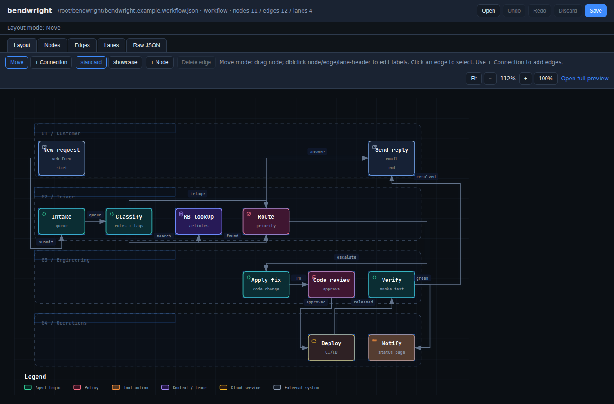
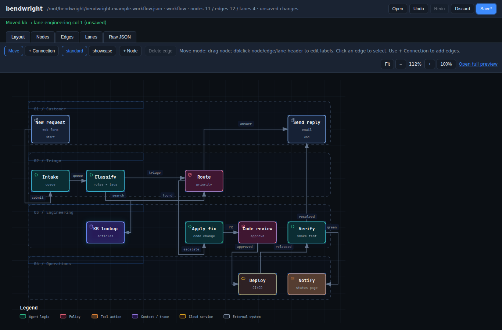
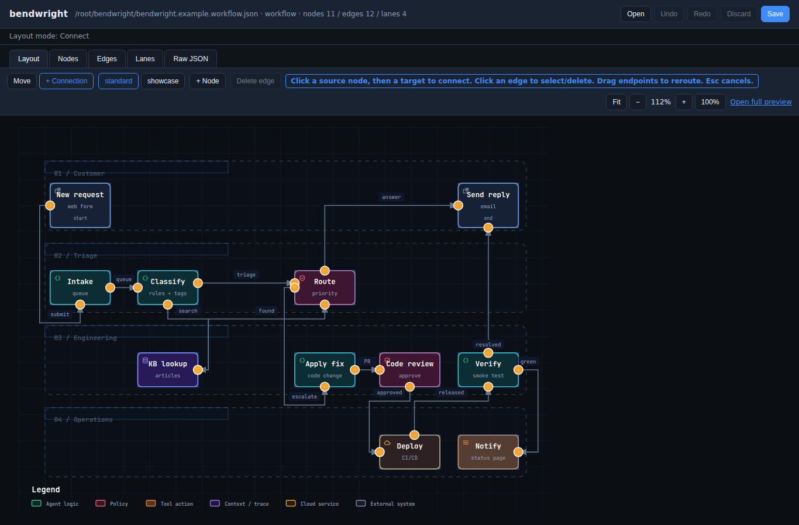
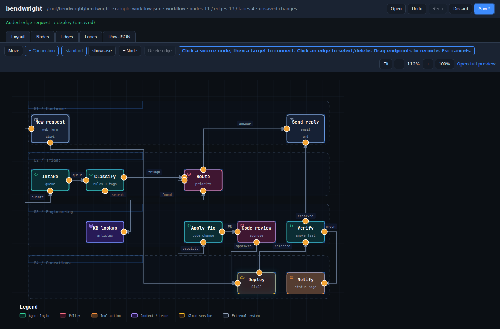
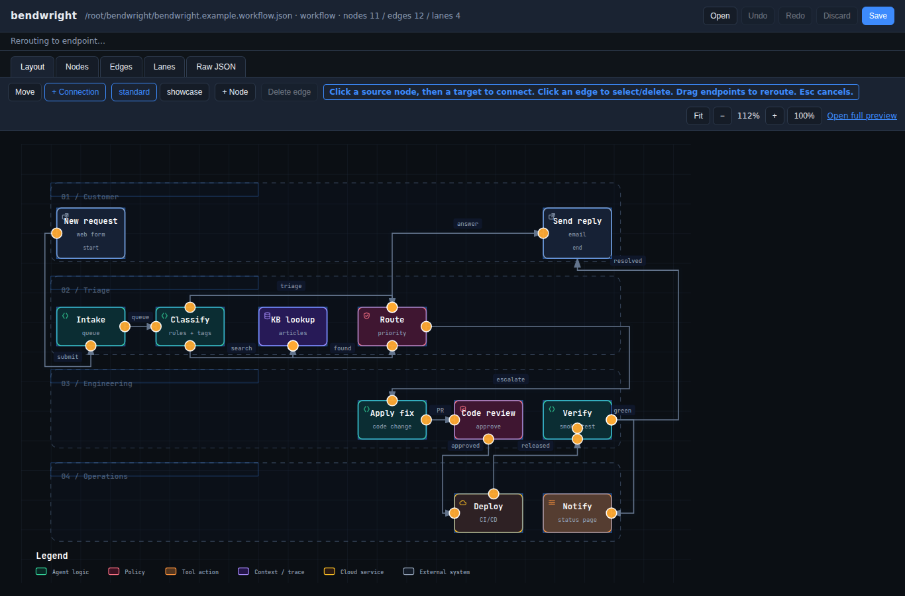
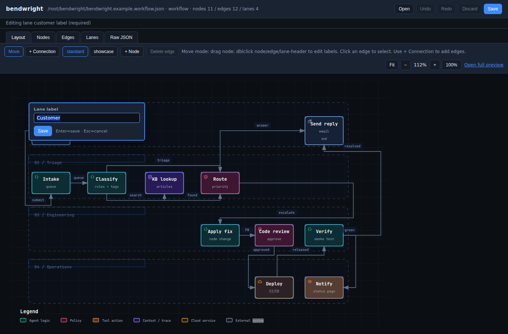
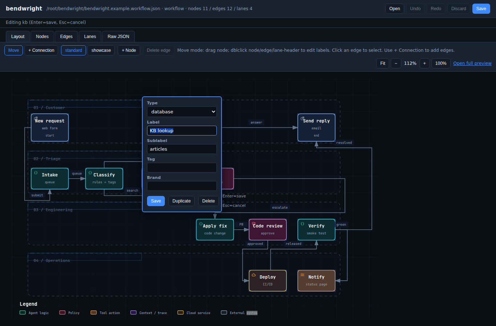

# bendwright

A local, offline editor for [Archify](https://github.com/tt-a1i/archify) workflow-diagram IR JSON.

bendwright edits the JSON that describes a workflow diagram; Archify renders it.
The JSON is always the source of truth. bendwright never edits rendered HTML or
SVG, so your diagram stays clean and reproducible.

It is a single Python file with no third-party dependencies. It runs a small
loopback web server on `127.0.0.1` and opens the editor in your browser. Nothing
leaves your machine.

## Features

- **Visual layout editing** - drag nodes; they snap to the nearest lane and column.
- **Nodes** - add, duplicate, and delete nodes. Multi-field editor for type,
  label, sublabel, tag, and brand.
- **Connections** - add an edge (click a source node, then a target), drag an
  endpoint to reroute, and select or delete edges.
- **Inline labels** - double-click a node, an edge, or a lane header to rename it.
- **Quality profiles** - toggle between `standard` and `showcase`. Invalid changes
  are rejected and reverted, so the file on disk is always renderable.
- **Explicit save** - edits live in a buffer and never touch disk until you press
  **Save**. Undo/redo, **Discard** (reload from disk), and an unsaved-changes
  warning are all included.
- **Lossless save** - key order, formatting, and trailing newline are preserved.
- **Native file picker** - open a diagram through your OS file dialog.
- **Auto-shutdown** - close the browser and the server (and its console window)
  shut down on their own a few seconds later.

## Requirements

- **Python 3.8+** (standard library only).
- **[Archify](https://github.com/tt-a1i/archify)** and **Node.js**, for validation
  and live preview. bendwright still runs a structural-check save without them,
  but you lose preview and full validation.

## Quick start

**Windows:** double-click `bendwright.bat`. Your browser opens; click **Open** to
pick a diagram. You can also drag a `*.workflow.json` file onto the `.bat` to open
it directly.

**Any platform:**

```
python bendwright.py                         # empty start; use Open in the UI
python bendwright.py path/to/diagram.workflow.json
python bendwright.py diagram.workflow.json --port 8770 --archify /path/to/archify.mjs
```

A sample diagram, `bendwright.example.workflow.json`, is included.

## Finding Archify

bendwright looks for `archify.mjs` in this order:

1. The `--archify /path/to/archify.mjs` argument.
2. The `ARCHIFY_HOME` environment variable, set to the Archify project directory
   (the folder whose `bin/` contains `archify.mjs`) or to the full path of
   `archify.mjs` itself.
3. An `archify/` checkout next to `bendwright.py`, then in the current directory
   and your home directory.
4. `archify` on your `PATH`.

## The IR format

A diagram is a single JSON object: `lanes`, `nodes`, `edges`, and optional
`meta`, `cards`, `mainPath`, and `semanticChecks`. See
`bendwright.example.workflow.json` for a complete, valid example, and the Archify
schema for the full contract.

## Screenshots

**Move nodes** - drag a node; it snaps to the nearest lane and column.




**Add a connection** - click a source node, then a target.




**Reroute a connection** - drag an endpoint to a different node.




**Edit labels** - double-click to rename a node, edge, or lane.



**Duplicate and delete** - manage nodes from the layout editor.



## License

[MIT](LICENSE)
