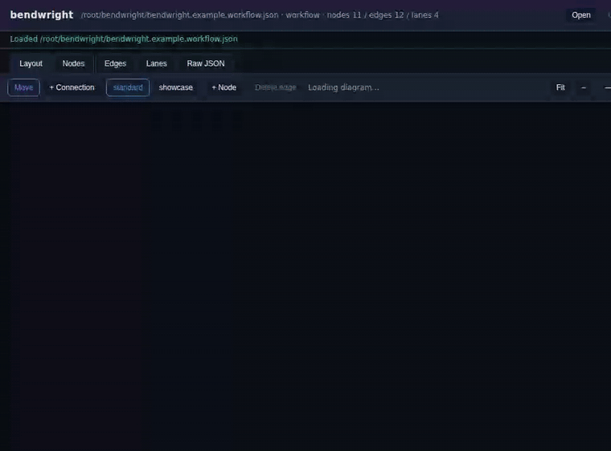
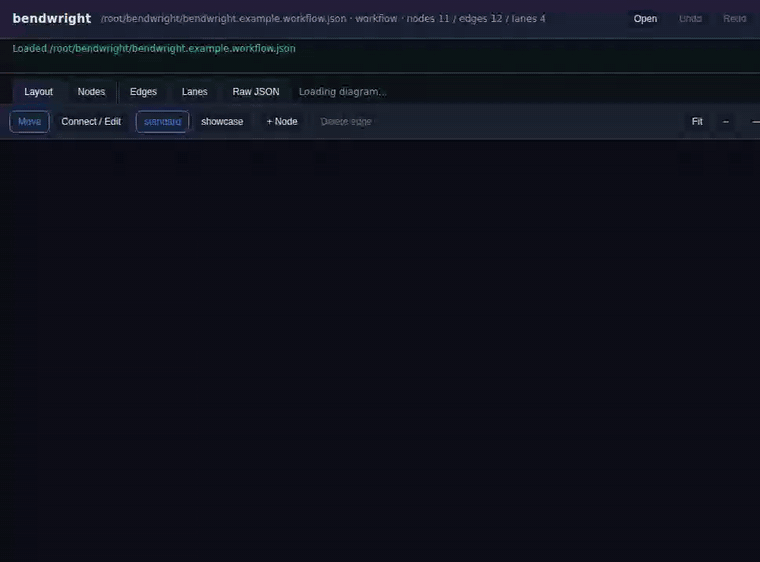
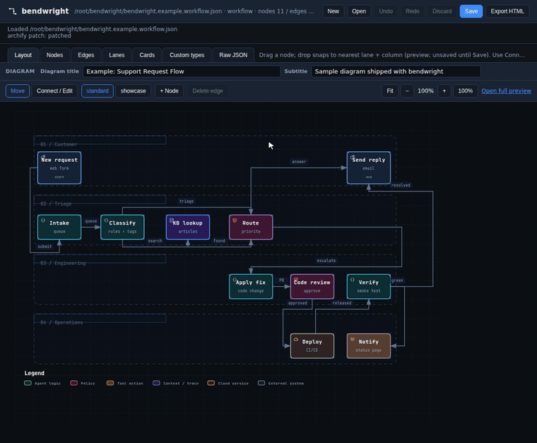
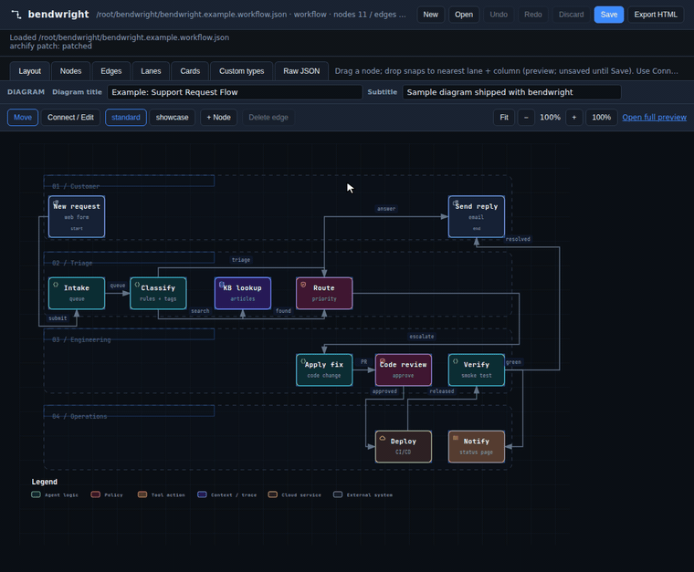
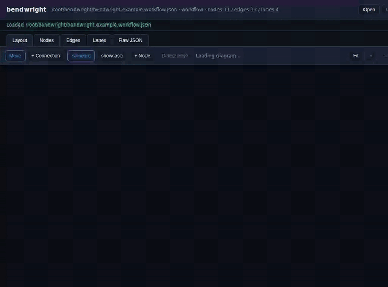

# bendwright

**The visual JSON editor nobody asked for.**

bendwright is a local, offline editor for [Archify](https://github.com/tt-a1i/archify)
workflow-diagram JSON. You bring a workflow JSON that already renders in Archify, and
bendwright lets you move nodes, rewire connections, and fix labels directly, then hands
the JSON back for Archify to render. The JSON stays the source of truth. bendwright
never touches the rendered HTML or SVG.

**Bring your own Archify JSON.** This edits Archify's workflow IR, not arbitrary JSON.
Point it at a `.workflow.json` that already works with Archify, make your edits, and save.

## Why this exists

I kept asking an AI to make small changes to an Archify diagram. Move one node, reroute
one arrow, fix a label. Every round it regenerated the whole thing and handed back a
diagram worse than the one I started with. bendwright is the boring fix: open the JSON,
change exactly what you meant to change, and nothing else.

It is a single Python file with no third-party dependencies. It runs a small loopback
web server on `127.0.0.1` and opens the editor in your browser. Nothing leaves your
machine.

## Features

- **Visual layout editing** - drag nodes; they snap to the nearest lane and column.
- **Nodes** - add, duplicate, and delete nodes. Multi-field editor for type,
  label, sublabel, tag, and brand.
- **Connections** - add an edge (click a source node, then a target), drag an
  endpoint to reroute, and select or delete edges.
- **Inline labels** - double-click a node, an edge, or a lane header to rename it.
- **Quality profiles** - toggle between `standard` and `showcase`. Invalid changes
  are rejected and reverted, so the file on disk is always renderable.
- **Explicit save** - edits live in a buffer and never touch disk until you press
  **Save**. Undo/redo, **Discard** (reload from disk), and an unsaved-changes
  warning are all included.
- **Lossless save** - key order, formatting, and trailing newline are preserved.
- **Export HTML** - one click saves the JSON and writes the rendered `.html` (via Archify) right next to it, always in sync. No CLI needed.
- **Native file picker** - open a diagram through your OS file dialog.
- **Auto-shutdown** - close the browser and the server (and its console window)
  shut down on their own a few seconds later.

## Setup

1. **Install the prerequisites.** Python 3.8 or newer, and (for validation and live
   preview) Node.js 18 or newer. bendwright itself has no third-party Python
   dependencies.

2. **Get Archify (the renderer).** The simplest setup for bendwright is to clone it
   next to bendwright:

   ```
   git clone https://github.com/tt-a1i/archify
   ```

   Archify also documents `npx skills add tt-a1i/archify -g`; if you install it that
   way, note the path to `archify.mjs` for step 4.

3. **Get bendwright.**

   ```
   git clone https://github.com/pcguywilson/bendwright
   ```

   Keep the two folders side by side, for example `code/archify` and `code/bendwright`.

4. **Point bendwright at Archify.** Any one of these:

   - Nothing to do if the `archify` folder sits next to the `bendwright` folder.
     bendwright finds `archify/bin/archify.mjs` on its own.
   - Set `ARCHIFY_HOME` to the Archify folder (the one whose `bin/` holds
     `archify.mjs`), or to the full path of `archify.mjs`.
   - Pass `--archify path/to/archify/bin/archify.mjs` when you launch.

Without Archify, bendwright still runs and saves with a structural check, but you
lose live preview and full validation.

## Running it

**Windows:** double-click `bendwright.bat`. Your browser opens; click **Open** to
pick a diagram. You can also drag a `*.workflow.json` file onto the `.bat` to open
it directly.

**Any platform:**

```
python bendwright.py                         # empty start; use Open in the UI
python bendwright.py path/to/diagram.workflow.json
python bendwright.py diagram.workflow.json --port 8770 --archify /path/to/archify.mjs
```

A sample diagram, `bendwright.example.workflow.json`, is included, so you can launch
and click Open to try it right away.

To get the rendered diagram, click **Export HTML** in the toolbar. bendwright saves
your JSON and writes `<name>.html` next to it, ready to open or share.

## The IR format

A diagram is a single JSON object: `lanes`, `nodes`, `edges`, and optional
`meta`, `cards`, `mainPath`, and `semanticChecks`. See
`bendwright.example.workflow.json` for a complete, valid example, and the Archify
schema for the full contract.

## Demos

**Move a node** - drag it; it snaps to the nearest lane and column.



**Add a connection** - switch to **+ Connection**, click a source node, then a target.



**Reroute a connection** - drag an endpoint onto a different node.



**Edit a label** - double-click a node, edge, or lane to rename it.


**Edit an edge label** - double-click the edge (its line, not the floating text) to rename the connection's label.



**Duplicate and delete** - clone a node, then remove it.



## License

[MIT](LICENSE)
