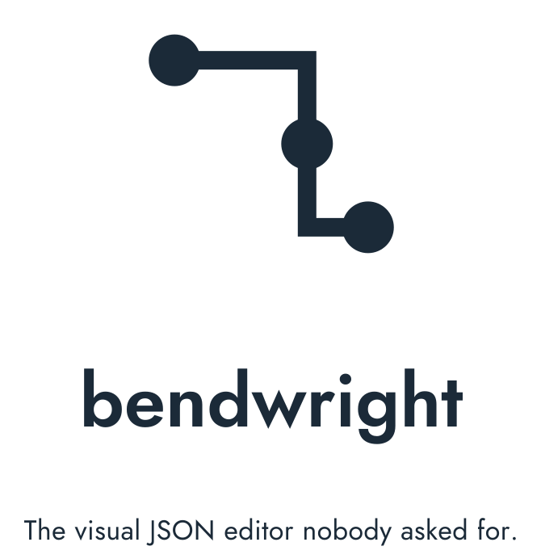
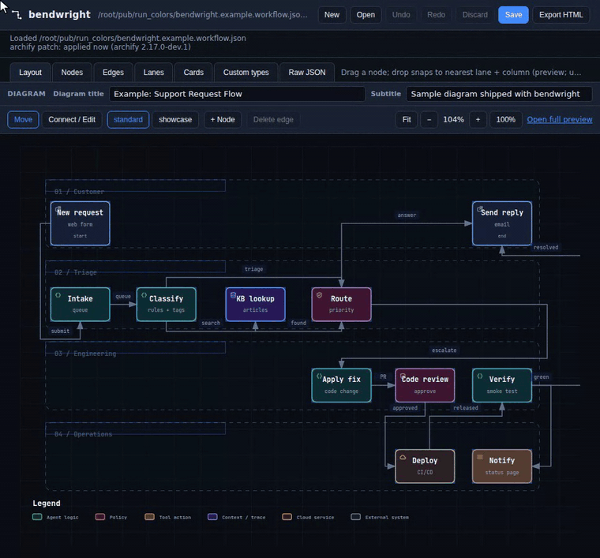
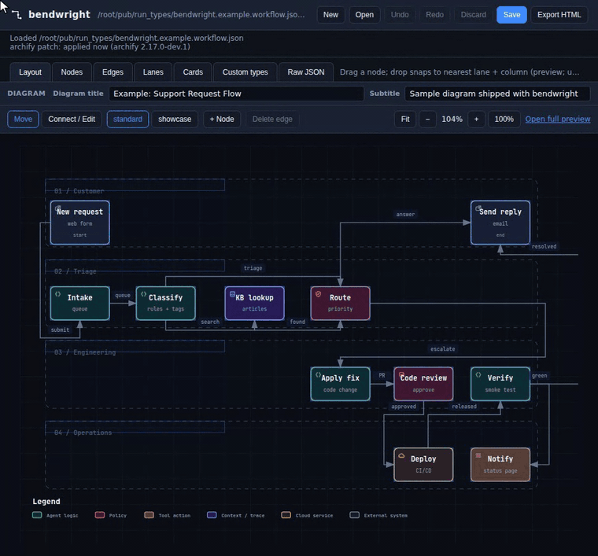
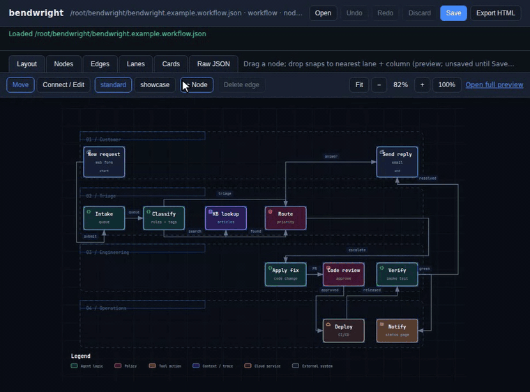

<p align="center">
  <picture>
    <source media="(prefers-color-scheme: dark)" srcset="docs/img/bendwright-lockup-dark.svg">
    
  </picture>
</p>

bendwright is a local, offline editor for [Archify](https://github.com/tt-a1i/archify)
workflow-diagram JSON. You bring a workflow JSON that already renders in Archify, and
bendwright lets you move nodes, rewire connections, and fix labels directly, then hands
the JSON back for Archify to render. The JSON stays the source of truth. Extras that
Archify's format has no field for (custom colors, custom types, your own icons) live in
a small `<name>.bendwright.json` file next to your diagram, so the diagram JSON always
stays valid Archify.

**Bring your own Archify JSON.** This edits Archify's workflow IR, not arbitrary JSON.
Point it at a `.workflow.json` that already works with Archify, make your edits, and save.

## Why this exists

I kept asking an AI to make small changes to an Archify diagram. Move one node, reroute
one arrow, fix a label. Every round it regenerated the whole thing and handed back a
diagram worse than the one I started with. bendwright is the boring fix: open the JSON,
change exactly what you meant to change, and nothing else.

It is a single Python file with no third-party dependencies. It runs a small loopback
web server on `127.0.0.1` and opens the editor in your browser. Nothing leaves your
machine.

## Features

- **Visual layout editing** - drag nodes; they snap to the nearest lane and column.
- **Nodes** - add, duplicate, and delete nodes. Multi-field editor for type,
  label, sublabel, tag, and color.
- **New diagram** - start from scratch with **New**. The first **Save** asks where to
  write it.
- **Diagram title** - edit the diagram title and subtitle at the top of the Layout tab.
- **Colors and line styles** - preset colors (blue, green, red, amber, purple, teal,
  gray) for nodes and edges, plus solid, dashed, or dotted lines. Readable in both the
  light and dark themes, and they keep working with Archify's data-flow animation.
- **Custom types** - define your own node types (for example "VM" or "File share") with
  a name, color, and icon on the **Custom types** tab. The name shows everywhere,
  including the exported page. Save a type to your library to reuse it in every diagram.
- **Icons** - pick from Archify's built-in logo catalog, a few extras bendwright ships
  for common infrastructure (Windows, Linux, Ubuntu, nginx, Apache, AWS, Azure, VM,
  web server, database), or your own PNGs.
- **Connections** - add an edge (click a source node, then a target), drag an
  endpoint to reroute, and select or delete edges.
- **Inline labels** - double-click a node, an edge, or a lane header to rename it.
- **Quality profiles** - toggle between `standard` and `showcase`. Invalid changes
  are rejected and reverted, so the file on disk is always renderable.
- **Explicit save** - edits live in a buffer and never touch disk until you press
  **Save**. Undo/redo, **Discard** (reload from disk), and an unsaved-changes
  warning are all included.
- **Lossless save** - key order, formatting, and trailing newline are preserved.
- **Export HTML** - one click saves the JSON and writes the rendered `.html` (via Archify) right next to it, always in sync. No CLI needed.
- **Native file picker** - open a diagram through your OS file dialog.
- **Auto-shutdown** - close the browser and the server (and its console window)
  shut down on their own a few seconds later.

## Setup

1. **Install the prerequisites.** Python 3.8 or newer, and (for validation and live
   preview) Node.js 18 or newer. bendwright itself has no third-party Python
   dependencies.

2. **Get Archify (the renderer).** The simplest setup for bendwright is to clone it
   next to bendwright:

   ```
   git clone https://github.com/tt-a1i/archify
   ```

   Archify also documents `npx skills add tt-a1i/archify -g`; if you install it that
   way, note the path to `archify.mjs` for step 4.

3. **Get bendwright.**

   ```
   git clone https://github.com/pcguywilson/bendwright
   ```

   Keep the two folders side by side, for example `code/archify` and `code/bendwright`.

4. **Point bendwright at Archify.** Any one of these:

   - Nothing to do if the `archify` folder sits next to the `bendwright` folder.
     bendwright finds `archify/bin/archify.mjs` on its own.
   - Set `ARCHIFY_HOME` to the Archify folder (the one whose `bin/` holds
     `archify.mjs`), or to the full path of `archify.mjs`.
   - Pass `--archify path/to/archify/bin/archify.mjs` when you launch.

Without Archify, bendwright still runs and saves with a structural check, but you
lose live preview and full validation.

## Running it

**Windows:** double-click `bendwright.bat`. Your browser opens; click **Open** to
pick a diagram. You can also drag a `*.workflow.json` file onto the `.bat` to open
it directly.

**Any platform:**

```
python bendwright.py                         # starts a new blank diagram
python bendwright.py path/to/diagram.workflow.json
python bendwright.py diagram.workflow.json --port 8770 --archify /path/to/archify.mjs
```

A sample diagram, `bendwright.example.workflow.json`, is included, so you can launch
and click Open to try it right away.

bendwright shuts its own server down a few seconds after you close the browser. If you
want it to stay running while you step away for a long time, launch with `--keep-alive`.

To get the rendered diagram, click **Export HTML** in the toolbar. bendwright saves
your JSON and writes `<name>.html` next to it, ready to open or share.

## Custom types, icons, and the Archify patch

**Where things live**

- `<name>.bendwright.json`, next to your diagram: this diagram's colors, custom types,
  and any of your own icons it uses. Written only when you **Save**. Keep it with the
  diagram if you move or share the JSON.
- `~/.bendwright/types.json` (`%USERPROFILE%\.bendwright\types.json` on Windows): your
  type library, shared across diagrams.
- `~/.bendwright/icons/`: your own icons. Drop a file in and click **Refresh icons** on
  the Custom types tab.

**Your own icons**

- PNG only, 64 KB or smaller. 64 to 128 px square with a transparent background works
  best; the icon is drawn at about 16 px in the node's corner.
- The file name is the icon name: lowercase letters, numbers, `-`, or `_`
  (for example `vm-server.png`). Other names are skipped with a note.
- A name already used by Archify's catalog or bendwright's extras is skipped. Pick a
  different name.
- Icons a diagram uses are copied into its `.bendwright.json`, so the diagram still
  renders on another machine. Exported HTML always has the icons built in.

**The Archify patch**

So that a custom type's name (say "VM") also appears in Archify's click panel, search,
and in-drawing legend, bendwright applies a small patch to the Archify install it uses.
It changes three files (`workflow-compiler.mjs`, `cli.mjs`, `template.html`) and keeps a
backup of each (`*.bendwright-orig`).

- The patch does nothing unless bendwright is the one rendering. Running Archify on its
  own gives its normal output.
- bendwright checks the patch at every start and re-applies it after an Archify
  update. If an update changed Archify too much, it restores the originals, shows a
  note, and falls back to showing custom names in tooltips and the page legend only.
  Exports keep working either way.
- Turn it off: set `ARCHIFY_BENDWRIGHT_PATCH=0`.
- Undo it: `python bendwright.py --unpatch-archify`.

Exported HTML is always a single self-contained file: colors, icons, and names are
baked in, and it opens anywhere without bendwright or Archify.

## The IR format

A diagram is a single JSON object: `lanes`, `nodes`, `edges`, and optional
`meta`, `cards`, `mainPath`, and `semanticChecks`. See
`bendwright.example.workflow.json` for a complete, valid example, and the Archify
schema for the full contract.

## Demos

**Move a node** - drag it; it snaps to the nearest lane and column.


**Add a connection** - switch to **Connect / Edit**, click a source node, then a target.


**Reroute a connection** - drag an endpoint onto a different node.


**Edit a label** - double-click a node, edge, or lane to rename it.


**Edit an edge label** - double-click the edge (its line, not the floating text) to rename the connection's label.


**Advanced edge settings** - double-click an edge, expand **Advanced** in the popup, and set a field like `variant` to `dashed`. The diagram updates live (unsaved until you Save).


**Duplicate and delete** - clone a node, then remove it.


**New diagram** - click **New**, set the diagram title, and edit the starter node.


**Colors and line styles** - double-click an edge, open **Advanced**, pick a color and dash style; double-click a node to set its color.



**Custom types** - on the **Custom types** tab, create "VM" with a color and icon, assign it to a node, and the name shows in the exported page's click panel and legend.



**Edit cards** - open the **Cards** tab, select a card, and edit its title, dot color, and items. Switch back to **Layout** and open the full preview to see the cards rendered under the diagram.



## License

[MIT](LICENSE)
