<p align="center">
  <picture>
    <source media="(prefers-color-scheme: dark)" srcset="docs/img/bendwright-lockup-dark.svg">
    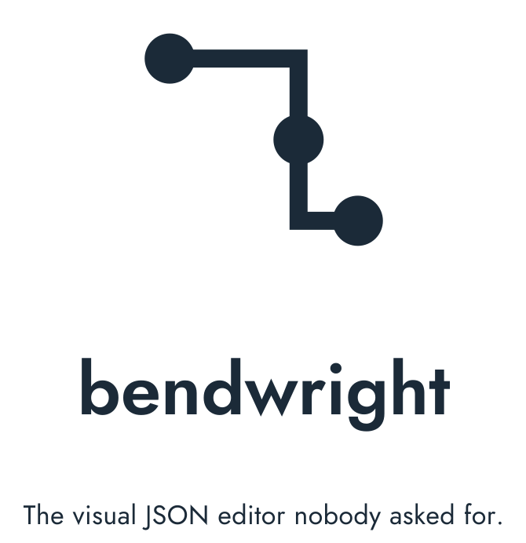
  </picture>
</p>

bendwright is a local, offline editor for [Archify](https://github.com/tt-a1i/archify)
workflow and architecture diagram JSON. You bring a diagram JSON that already renders in
Archify, and bendwright lets you move nodes, rewire connections, and fix labels directly, then hands
the JSON back for Archify to render. The JSON stays the source of truth. Extras that
Archify's format has no field for (custom colors, custom types, your own icons) live in
a small `<name>.bendwright.json` file next to your diagram, so the diagram JSON always
stays valid Archify.

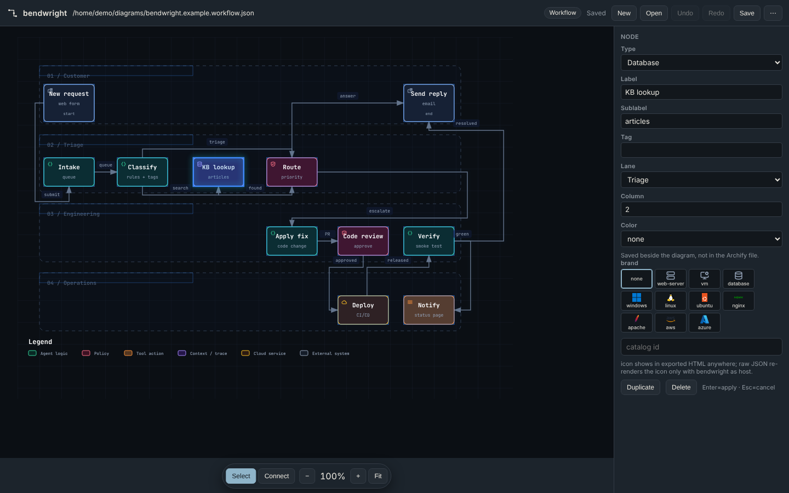

**Start from scratch or bring your own.** Click **New** for a blank workflow or
architecture diagram, or start from one of the built-in templates (request and approval,
incident response, three-tier web app, data pipeline). Or open a `.workflow.json` or
`.architecture.json` that already works with Archify. bendwright edits Archify's workflow
and architecture IR, not arbitrary JSON.

**Help inside the app.** The **?** button in the header (or **Help** in the **⋯** menu)
opens a how-to guide in a new tab.

## Contents

- [Why this exists](#why-this-exists)
- [Setup](#setup)
- [Running it](#running-it)
- [Tour](#tour)
  - [Editing nodes](#editing-nodes)
  - [Connections](#connections)
  - [Icons and custom types](#icons-and-custom-types)
  - [Architecture diagrams](#architecture-diagrams)
  - [Cards and legend](#cards-and-legend)
  - [Safe by default](#safe-by-default)
- [Keyboard shortcuts](#keyboard-shortcuts)
- [Features](#features)
- [Custom types, icons, and the Archify patch](#custom-types-icons-and-the-archify-patch)
- [The IR format](#the-ir-format)
- [License](#license)

## Why this exists

I kept asking an AI to make small changes to an Archify diagram. Move one node, reroute
one arrow, fix a label. Every round it regenerated the whole thing and handed back a
diagram worse than the one I started with. bendwright is the boring fix: open the JSON,
change exactly what you meant to change, and nothing else.

It is a single Python file with no third-party dependencies. It runs a small loopback
web server on `127.0.0.1` and opens the editor in your browser. Nothing leaves your
machine.

## Setup

1. **Install the prerequisites.** Python 3.8 or newer, and (for validation and live
   preview) Node.js 18 or newer. bendwright itself has no third-party Python
   dependencies.

2. **Get Archify (the renderer).** The simplest setup for bendwright is to clone it
   next to bendwright:

   ```
   git clone https://github.com/tt-a1i/archify
   ```

   Archify also documents `npx skills add tt-a1i/archify -g`; if you install it that
   way, note the path to `archify.mjs` for step 4.

3. **Get bendwright.**

   ```
   git clone https://github.com/pcguywilson/bendwright
   ```

   Keep the two folders side by side, for example `code/archify` and `code/bendwright`.

4. **Point bendwright at Archify.** Any one of these:

   - Nothing to do if the `archify` folder sits next to the `bendwright` folder.
     bendwright finds `archify/bin/archify.mjs` on its own.
   - Set `ARCHIFY_HOME` to the Archify folder (the one whose `bin/` holds
     `archify.mjs`), or to the full path of `archify.mjs`.
   - Pass `--archify path/to/archify/bin/archify.mjs` when you launch.

Without Archify, bendwright still runs and saves with a structural check, but you
lose live preview and full validation.

## Running it

**Windows:** double-click `bendwright.bat`. Your browser opens; click **Open** to
pick a diagram. You can also drag a `*.workflow.json` or `*.architecture.json` file onto
the `.bat` to open it directly.

**Any platform:**

```
python bendwright.py                         # starts a new blank diagram
python bendwright.py path/to/diagram.workflow.json
python bendwright.py diagram.workflow.json --port 8770 --archify /path/to/archify.mjs
```

Two sample diagrams, `bendwright.example.workflow.json` and
`bendwright.example.architecture.json`, are included, so you can launch and click Open to
try them right away. To start fresh, click **New** and pick a blank diagram or a template.

bendwright shuts its own server down a few seconds after you close the browser. If you
want it to stay running while you step away for a long time, launch with `--keep-alive`.

To get the rendered diagram, choose **Export HTML** from the **⋯** menu. bendwright saves
your JSON, then asks where to write the `.html` (next to the JSON by default) and whether
it should open in the dark theme, the light theme, or match the viewer's system.

## Tour

Every clip uses the two sample diagrams that ship with bendwright.

### Editing nodes

**Inspect and edit** - click a node, change its label and sublabel in the inspector, and
press **Enter**. Or double-click it and type the new name right on the diagram. Archify re-renders right away; nothing touches disk until **Save**.

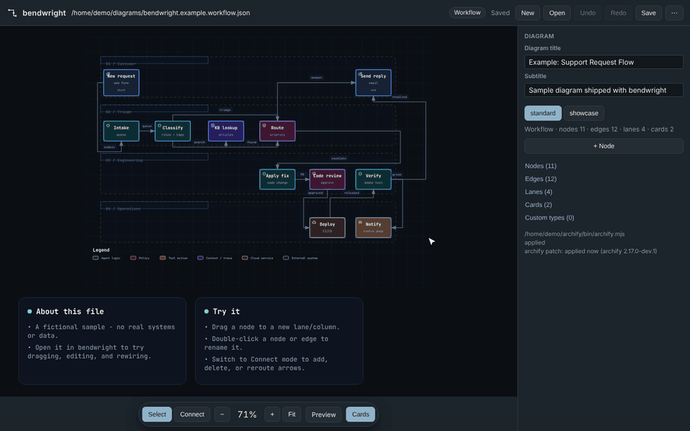

**Move a node** - drag it; it snaps to the nearest lane and column. **Undo** puts it back.

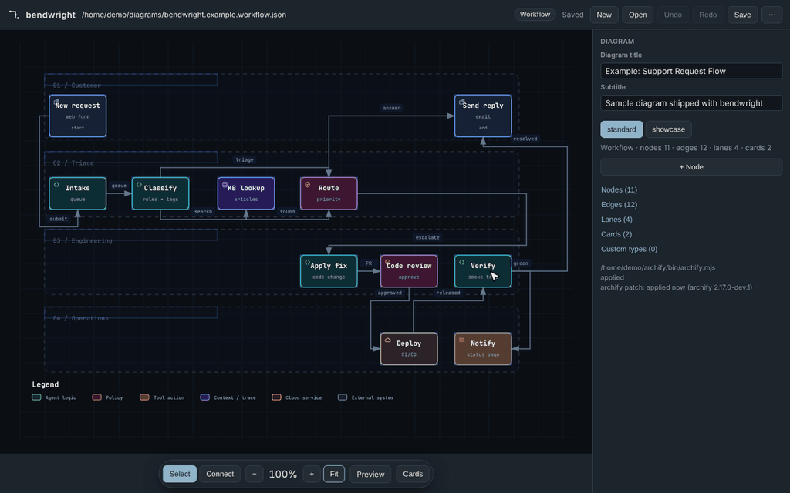

**Delete asks first** - press **Delete** or click **Delete** in the inspector and
bendwright names what will go (for a node, how many edges go with it) before anything
changes. **Esc** or **Cancel** keeps it; **Undo** brings back anything you did delete.

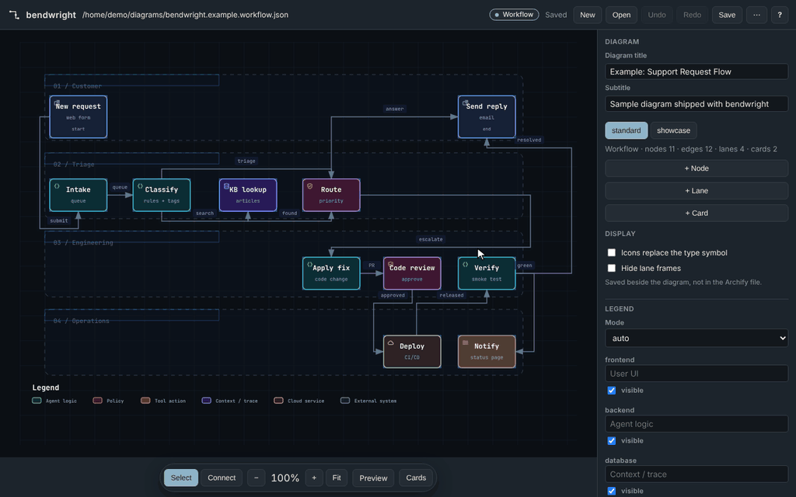

Duplicate lives in the node inspector. **New** starts a blank workflow or architecture
diagram.

### Connections

**Connect and reroute** - press **C**, click a source, then a target. Drag an endpoint
onto another node to reroute the connection.

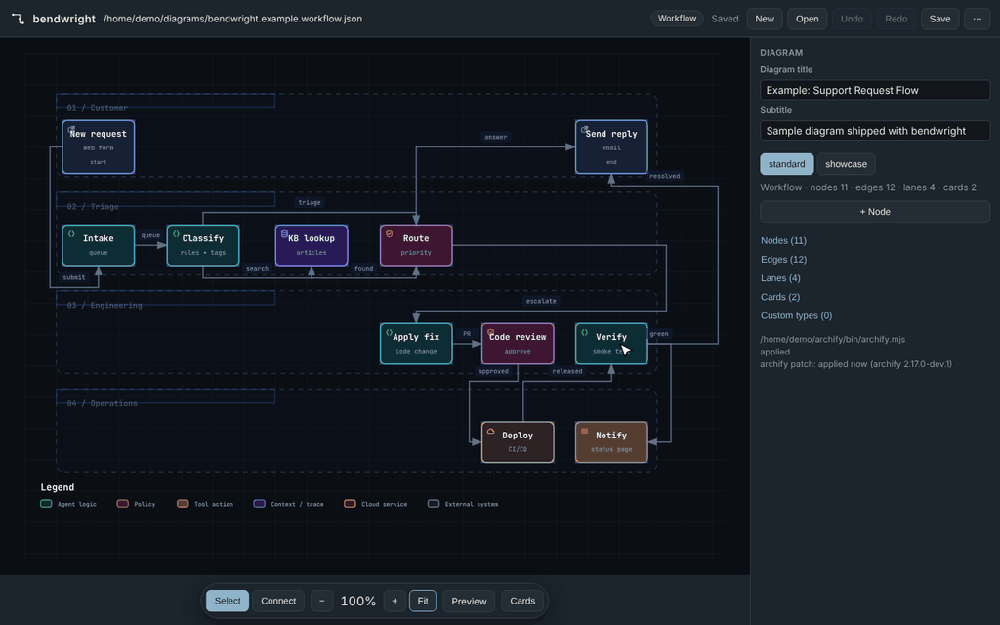

**Style an edge** - click a connection, pick a line style and color, and rename it. Line
and color are saved beside the diagram, so the Archify JSON stays valid.

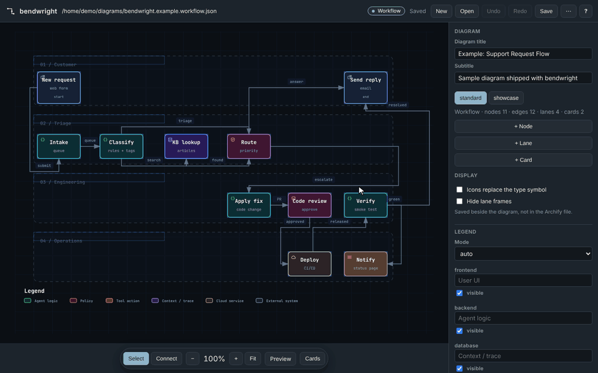

### Icons and custom types

Search the icon picker in the inspector and pick a logo; it shows on the node right away.
Then pick **+ New custom type...** in the Type list to name a type and apply it on the
spot.

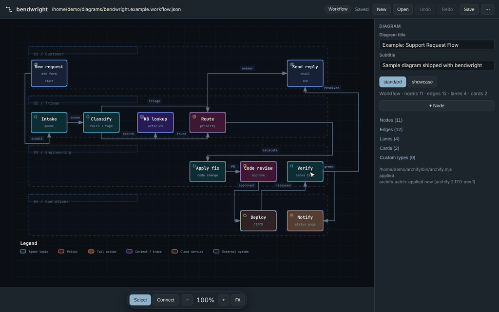

### Architecture diagrams

**Position and resize** - set a component's position in the inspector (its boundary grows
to fit), then drag another component's corner grip to resize it.

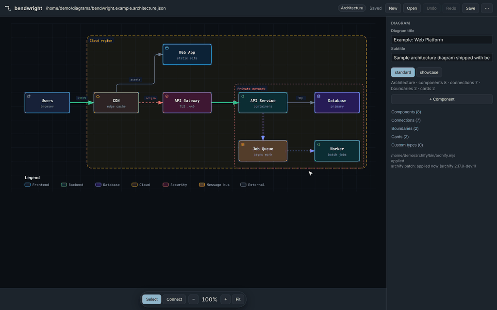

**Boundaries** - click a boundary to edit it in place, then press **B** and drag a
rectangle around components to draw a new one.

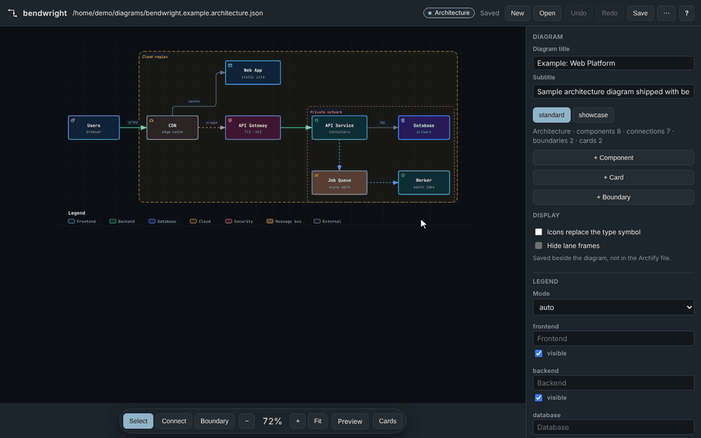

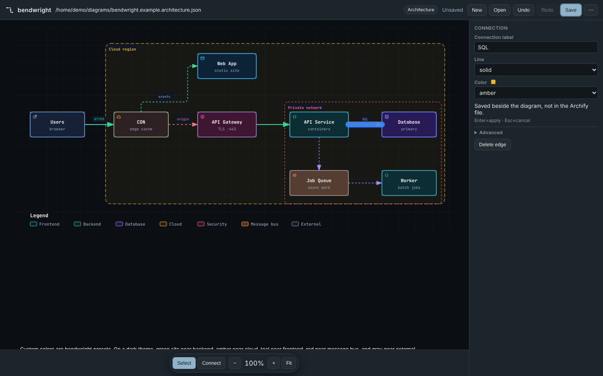

### Cards and legend

Cards show under the drawing while you edit. Click one to change its title, dot color, and
items, or add one with **+ Card**; **Cards** on the tool bar hides them. With nothing
selected, the inspector's **Legend** section sets the legend mode (auto, all, or hidden)
and renames or hides each built-in type.

### Safe by default

An edit Archify rejects is put back right away. A red chip stays in the header; click it
to see why. Your file is never left unrenderable.


## Keyboard shortcuts

| Key | Action |
|---|---|
| **V** | Select tool |
| **C** | Connect tool |
| **B** | Boundary tool (architecture) |
| **F2** | Rename the selection in place |
| **Tab** / **Shift+Tab** | Next / previous field while renaming a node |
| **Enter** | Apply edits |
| **Esc** | Discard unapplied edits, close a panel, or clear the selection |
| **Delete** / **Backspace** | Delete the selected node, edge, card, boundary, or lane (asks first) |
| **Ctrl+S** | Save (shows where; **Enter** saves in place) |
| **Ctrl+Z** | Undo |
| **Ctrl+Y** / **Ctrl+Shift+Z** | Redo |

Tool keys are ignored while you type in a field.

## Features

### The editor

- **Workflow and architecture diagrams** - open either kind. The canvas is the live
  Archify render. Click anything and its fields open in the inspector on the right;
  with nothing selected, the inspector shows the diagram itself and **Browse** links to
  every node, edge, lane (or component, connection, boundary), card, and custom type.
- **Visual layout editing** - drag nodes; in a workflow they snap to the nearest lane and
  column, in an architecture diagram they snap to a 10 px grid.
- **Nodes** - add, duplicate, and delete nodes. The inspector edits type, label,
  sublabel, tag, position (lane and column, or position and size), color, and icon.
  **Enter** applies your edits as one undo step; **Esc** throws them away.
- **Connections** - add, reroute, restyle, relabel, and delete edges.
- **Rename in place** - double-click a node, edge, lane, boundary, or card title (or
  press **F2** on a selection) and type right on the diagram. On a node, double-click the
  sublabel or tag to edit those, and **Tab** moves between label, sublabel, and tag.
  **Enter** saves, **Esc** cancels.
- **Boxes grow to fit** - type a long label and the node or component widens on its own,
  so you can drop in rough nodes now and fill in details later.
- **Preview** - **Preview** on the bottom tool bar opens the full rendered page in a new tab.
- **New diagram and templates** - **New** starts a blank workflow or architecture
  diagram, or one of four starter templates. The first **Save** asks where to write it.
- **Built-in guide** - **?** in the header opens a how-to guide in a new tab.
- **Native file picker** - open a diagram through your OS file dialog.

### Diagram parts

- **Diagram title** - with nothing selected, edit the title and subtitle in the inspector.
- **Resize** - in an architecture diagram, select a component and drag the corner grip.
- **Boundaries** - click a boundary's border or label to edit its kind, label, padding,
  and members; click components to add or remove them. Press **B** and drag a rectangle
  to draw a new boundary around the components inside it.
- **Cards** - edit cards in place under the drawing, or hide them with **Cards**.
- **Legend** - legend mode (auto, all, hidden) plus a label and visibility per type.
- **Lanes** - click a lane to rename it, set its variant, move it up or down, delete it,
  or add a new one with **+ Lane**.

### Look and feel

- **Colors and line styles** - preset colors (blue, green, red, amber, purple, teal,
  gray) for nodes and edges, plus solid, dashed, or dotted lines. Readable in both the
  light and dark themes, and they keep working with Archify's data-flow animation.

  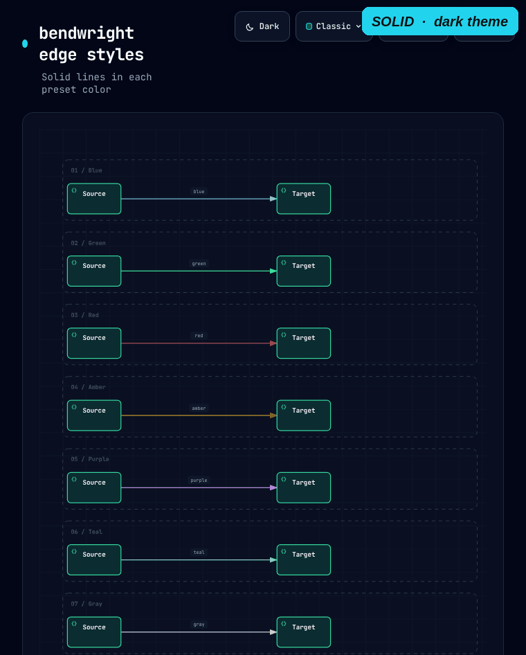
- **Custom types** - define your own node types (for example "VM" or "File share") with
  a name, color, and icon in the **Custom types library** (the **⋯** menu). The name shows
  everywhere, including the exported page. Save a type to your library to reuse it in
  every diagram, or pick **+ New custom type...** at the bottom of any Type list to make
  one on the spot.
- **Icons** - a searchable picker (by name, alias, or category) with Archify's built-in
  logo catalog, a few extras bendwright ships for common infrastructure, and your own
  PNGs. The catalog is read from your Archify install, so logos Archify adds later show up
  automatically.

### Display options

With nothing selected, the inspector's **Display** section has two per-diagram switches.
Both are saved beside the diagram and only change how bendwright renders it; the Archify
JSON is untouched, and running Archify on its own gives its normal output.

- **Icons replace the type symbol** - a node with an icon shows that icon in the top-left
  corner instead of the type symbol. With it off, the icon sits in the top-right corner.
- **Hide lane frames** - a workflow draws no lane frames or lane headers. The lanes still
  exist (Archify needs them), so you can still click and edit them.

### Files and safety

- **Quality profiles** - toggle between `standard` and `showcase`. Changes Archify
  rejects are reverted on the spot and the reason stays in a red chip in the header
  until you close it, so the file on disk is always renderable.
- **Ask before deleting** - deleting a node, edge, card, boundary, lane, or custom type
  asks first, and **Undo** brings it back.
- **Explicit save** - edits live in a buffer and never touch disk until you press
  **Save**. Save shows where it will write: press **Enter** to save in place, or change
  the name or folder (or **Browse...**) to save a copy. Saving over a different file asks
  first. Undo/redo, **Discard changes** (reload from disk, in the **⋯** menu), and an
  unsaved-changes warning are all included.
- **Lossless save** - key order, unknown fields, and the trailing newline are preserved.
  Files are written with 2-space indentation.
- **Export HTML** - from the **⋯** menu: saves the JSON, then writes the rendered `.html`
  (via Archify) where you choose, next to the JSON by default. Pick the theme it opens
  in (dark, light, or match the viewer's system); a `?theme=` link and the page's own
  toggle still work. The location and theme are remembered for each diagram. No CLI
  needed.
- **Two diagrams at once** - launch bendwright twice; the second one picks the next free
  port (8771, 8772, ...). If one tab opens a different diagram, any other tab on that
  server asks you to reload instead of saving into the wrong file.
- **Auto-shutdown** - close the browser and the server (and its console window) shut down
  on their own a few seconds later.

## Custom types, icons, and the Archify patch

**Where things live**

- `<name>.bendwright.json`, next to your diagram: this diagram's colors, custom types,
  and any of your own icons it uses. Written only when you **Save**. Keep it with the
  diagram if you move or share the JSON.
- `bendwright-data/types.json`, next to `bendwright.py`: your type library, shared
  across diagrams.
- `bendwright-data/icons/`, next to `bendwright.py`: your own icons. Drop a file in and
  choose **Refresh icons** from the **⋯** menu.
- `bendwright-data/` also holds the Archify patch record. It is git-ignored, so your
  icons and types never end up in a commit. To keep it elsewhere, set
  `BENDWRIGHT_DATA_DIR` to an absolute path.

**Your own icons**

- Eight sample icons ship in `examples/icons/` (user, server, queue, lock, cloud, file,
  upload, attachment). They
  are original artwork under this repo's MIT license. Copy them into
  `bendwright-data/icons/` and choose **Refresh icons** from the **⋯** menu to try them.

- PNG only, 64 KB or smaller. 64 to 128 px square with a transparent background works
  best; the icon is drawn at about 22 px in the node's corner.
- The file name is the icon name: lowercase letters, numbers, `-`, or `_`
  (for example `vm-server.png`). Other names are skipped with a note.
- A name already used by Archify's catalog or bendwright's extras is skipped. Pick a
  different name.
- Icons a diagram uses are copied into its `.bendwright.json`, so the diagram still
  renders on another machine. Exported HTML always has the icons built in.

**The Archify patch**

So that a custom type's name (say "VM") also appears in Archify's click panel, search,
and in-drawing legend, bendwright applies a small patch to the Archify install it uses.
It changes four files (`workflow-compiler.mjs`, `render-architecture.mjs`, `cli.mjs`,
`template.html`) and keeps a backup of each (`*.bendwright-orig`).

- The patch does nothing unless bendwright is the one rendering. Running Archify on its
  own gives its normal output.
- bendwright checks the patch at every start and re-applies it after an Archify
  update. If an update changed Archify too much, it restores the originals, shows a
  note, and falls back to showing custom names in tooltips and the page legend only.
  Exports keep working either way.
- Turn it off: set `ARCHIFY_BENDWRIGHT_PATCH=0`.
- Undo it: `python bendwright.py --unpatch-archify`.

Exported HTML is always a single self-contained file: colors, icons, and names are
baked in, and it opens anywhere without bendwright or Archify.

## The IR format

A workflow diagram is a single JSON object: `lanes`, `nodes`, `edges`, and optional
`meta`, `cards`, `mainPath`, and `semanticChecks`. An architecture diagram has
`components` (with `pos` and `size`), `connections`, and optional `boundaries`, `cards`,
and `meta`. See `bendwright.example.workflow.json` and
`bendwright.example.architecture.json` for complete, valid examples, and the Archify
schemas for the full contract.

## License

[MIT](LICENSE)
